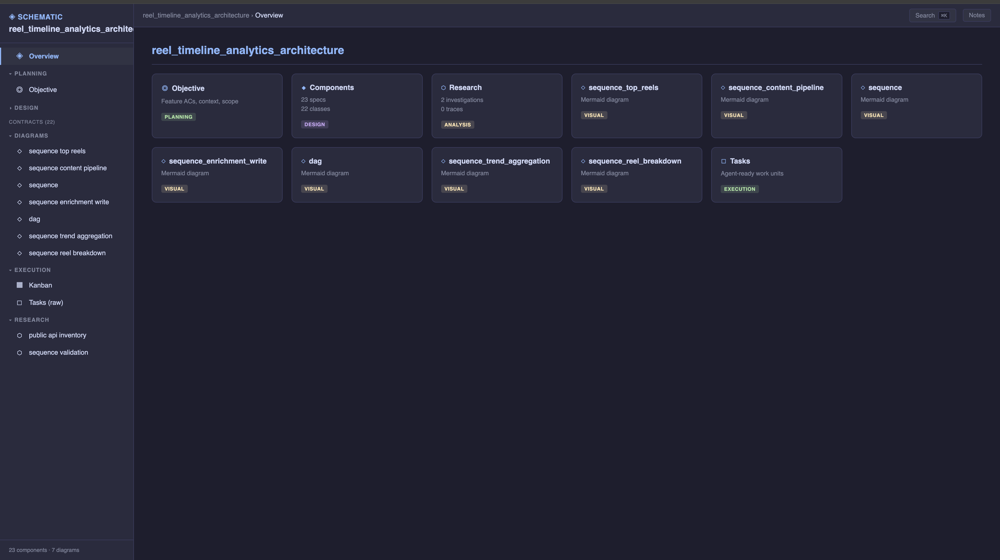
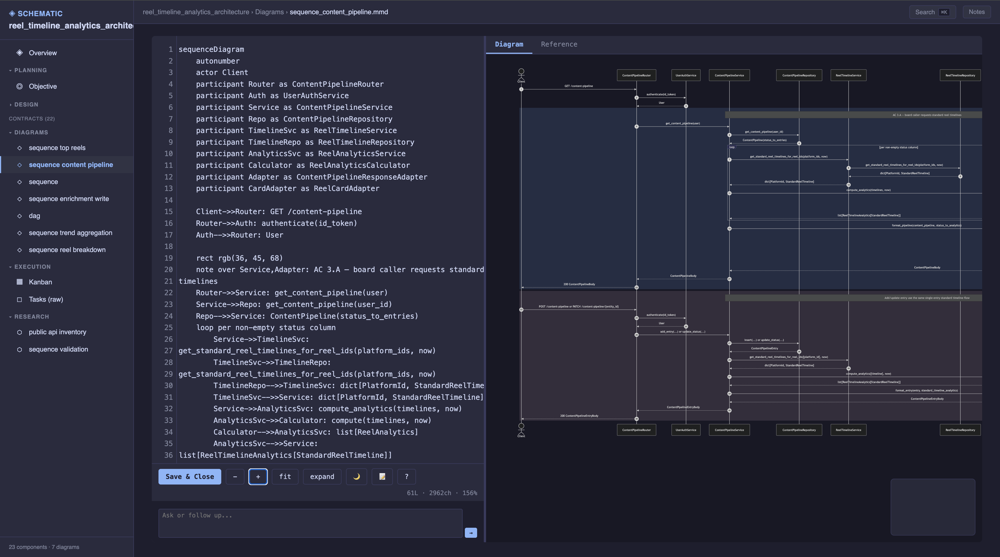
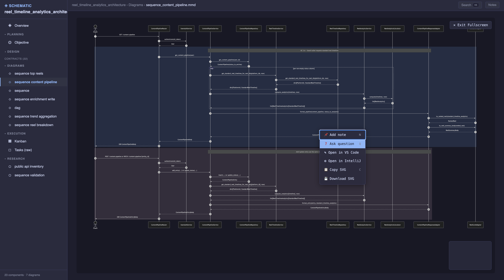
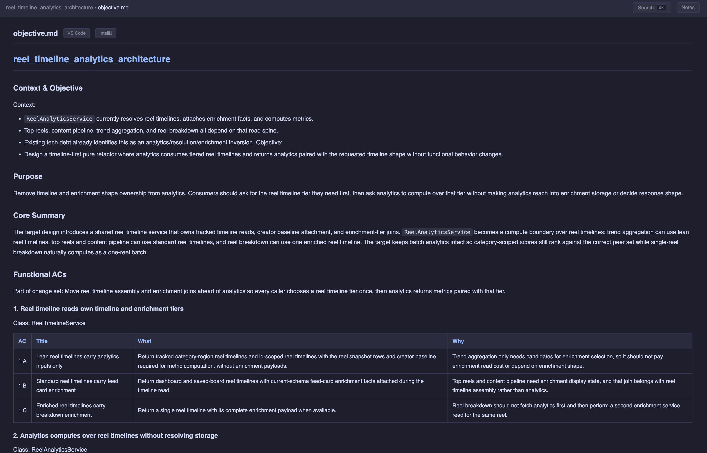
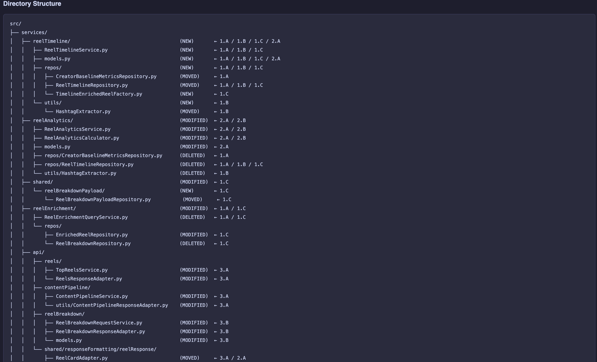
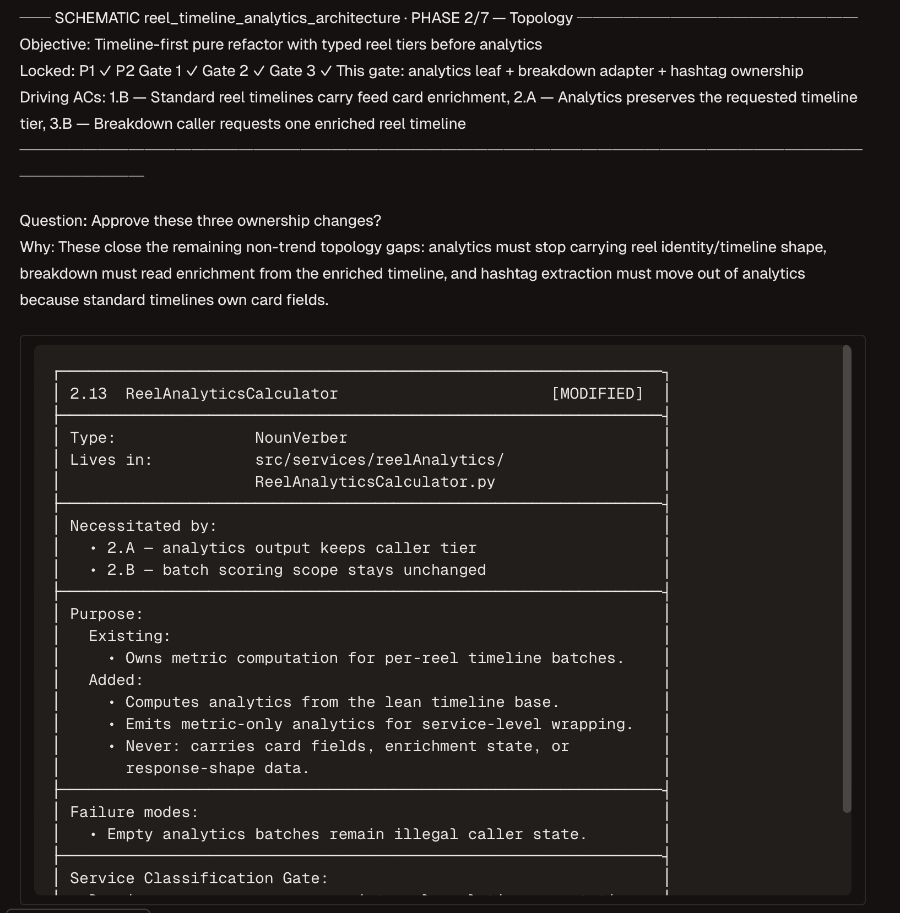
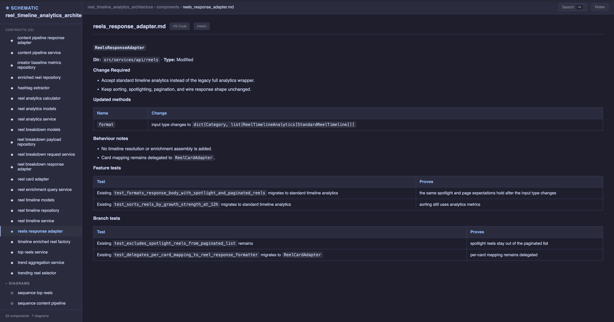
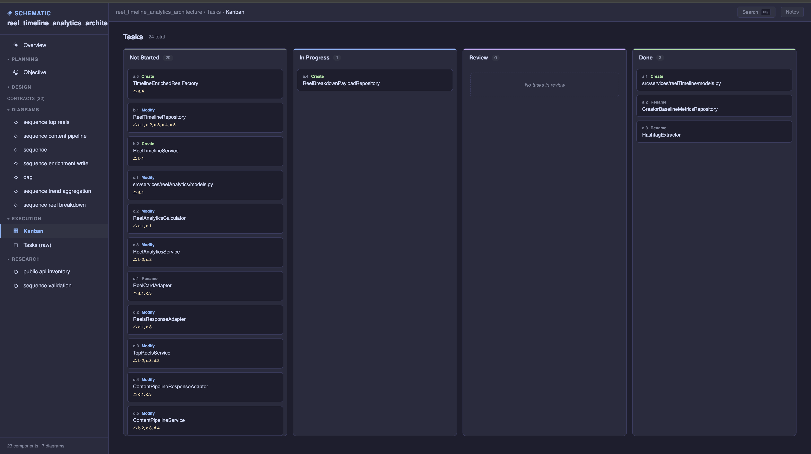
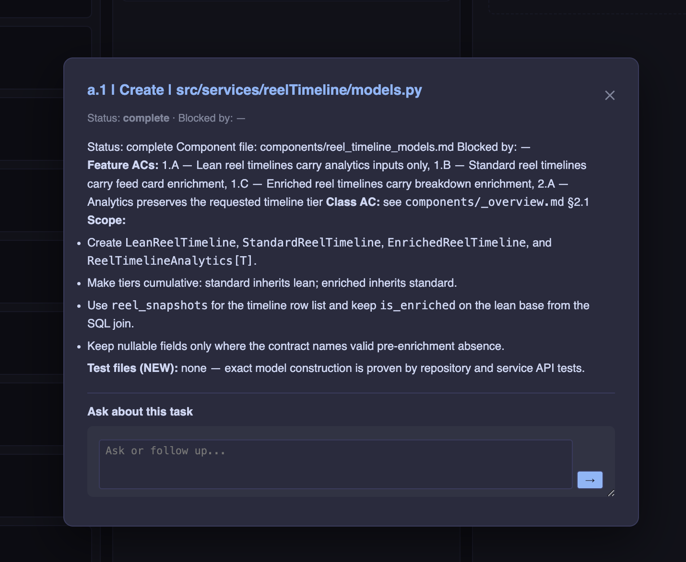

# Schematic

**Design-first feature delivery for Claude Code.** Schematic turns "build me X" into a locked, cross-referenced engineering blueprint — feature ACs, class topology, per-class contracts with tests, an injection DAG, a sequence diagram, and agent-ready tasks — then drives implementation against that blueprint with hard gates a language model cannot talk its way past.

The premise is simple: **the design is the contract.** Code that diverges from the schematic is corrected — or the schematic is amended with sign-off. Nothing lands silently.







## Why

Agent-written features fail in predictable ways: responsibilities drift between classes, contracts change mid-implementation, tests assert what the code does rather than what was agreed, and "done" is narrated rather than verified. Schematic attacks each failure structurally:

- **Every decision traces.** Feature AC → Class AC → Function AC → AC Test. A traceability matrix proves the pyramid is complete before a line of code is written.
- **Every gate is enforced by a CLI, not by discipline.** Phases can't lock without a recorded audit + user sign-off + on-disk artifacts. Tasks can't complete without a clean review verdict. Diagrams can't lock if they don't parse.
- **Every audit is a background agent** with a strict output schema, severity gates, and a do-not-flag list — signal, not a 20-bullet wall.
- **Standards are pluggable.** The skill absorbs *your* conventions per slot (architecture, component types, styling per language, testing, review) and quotes them back at every phase. No manifest? It onboards you — or learns the conventions from your own codebase.

## Install

```bash
git clone https://github.com/Meeks91/Schematic.git ~/.claude/skills/schematic
```

Or project-level:

```bash
git clone https://github.com/Meeks91/Schematic.git .claude/skills/schematic
```

Symlink the CLI onto PATH:

```bash
ln -s ~/.claude/skills/schematic/scripts/schematic ~/.claude/scripts/schematic
ln -s ~/.claude/skills/schematic/scripts/schematic-task-done ~/.claude/scripts/schematic-task-done
```

Zero runtime dependencies — the CLI, the audit protocol, the dashboard, and the Mermaid editor are stdlib Python + vanilla JS.

## Usage

Invoke `/schematic` in Claude Code, or ask to architect a feature end-to-end before implementation. `schematic init <feature>` scaffolds the bundle and reports your standards coverage slot by slot.

## The pipeline

| # | Phase | Output | Gate |
|---|---|---|---|
| 0 | Standards Resolution | `.claude/standards.json` | interview / learn-from-codebase |
| 1 | Objective & Feature ACs | `objective.md`, `research/*.md` | audit + sign-off |
| 2 | Topology (Class ACs) | `components/_overview.md` | audit + sign-off |
| 3 | Directory Structure | `objective.md` §Directory | artifact check |
| 4 | Contracts, Models, Tests | `components/<class>.md`, traceability matrix | audit + sign-off |
| 5 | Injection DAG | `dag.mmd`, §DAG + §Integration | artifact check + **mermaid validation** |
| 6 | Sequence Diagram | `sequence.mmd`, §Sequence | audit + artifact check + **mermaid validation** |
| 7 | Tasks | `tasks.md` | end-to-end audit + sign-off |
| 8 | Implementation | code + `implementation_report.md` | per-task review verdicts + pristine sweep + e2e gate |
| 9 | Compression | knowledge merged into repo arch docs | lock, then cleanup |

Phase 8 runs **manual** (sketch → confirm → implement, per task) or **auto** (user-opted autonomous loop with per-task diff reviews, a batch-until-pristine style sweep, and a master-agent correctness gate). Re-sweeps are incremental: files unchanged since their last clean review are skipped, not re-reviewed.

**Phase 1 — the objective**, human-readable in two minutes, and **Phase 3 — the feature's footprint**, every file annotated with the AC that necessitated it:

<p>
  
  
</p>

**Phase 4 — per-class contracts**: signatures, models, behaviour notes, and the feature/branch tests that prove them, one self-contained card per class:

<p>
  
  
</p>

**Phase 8 — execution**: tasks flow across a kanban driven entirely by the CLI's legal state transitions; review findings land as notes on the task:

<p>
  
  
</p>

## Enforcement gates

| Gate | What it prevents |
|---|---|
| `phase complete` artifact checks | Artifacts shown in chat but never written to disk |
| `phase complete` mermaid checks (P5/P6) | Locking a DAG or sequence diagram that doesn't parse |
| `phase complete` audit + sign-off | Locking a phase without its quality gate |
| `task next` auto-claim | Implementation starting without a kanban state change |
| `task status` legal transitions | Illegal task state jumps |
| `task complete` / `schematic-task-done` review check | Completing a task that never passed review |
| `schematic-task-done --matched/--updated` | Silent schematic drift — divergence is recorded, always |
| `schematic validate` | Cross-reference rot (blockers, component files, AC pyramid) |
| Incremental sweeps | Token burn from re-reviewing already-clean files |

## CLI

`schematic --help` is the surface of record. Command groups:

```
schematic init|status|validate|mermaid            bundle lifecycle + integrity
schematic phase audit|sign-off|complete           gate state, phases 1-9 (audit: 1,2,4,6,7)
schematic task next|show|status|note|review-result|complete    task loop
schematic review start|sweep|batch-result|e2e|e2e-result|status  phase 8 review
schematic questions / schematic answer            dashboard Q&A relay
schematic overview                                browser dashboard
schematic track init|validate|show                execution traces
schematic-task-done <tag> --matched y|n --updated y|n   completion + drift report
```

## Standards manifest (Phase 0)

Schematic absorbs the conventions of the repo it runs in. Each **slot** maps to a module; anything unmapped is **learned** from your codebase's exemplar directories and written back as a reviewed module.

| Slot | Governs | Consumed by |
|---|---|---|
| `architecture` | service layout, directories, DI, boundaries | P2, P3, P5 |
| `types` | class-suffix vocabulary, banned suffixes | P2 + audits |
| `styling.<language>` | naming, idioms, defensive-code policy | P4, P8 (inlined into sweep prompts) |
| `testing` | test planning, naming, assertion style | P4, P7, P8 (inlined into sweep prompts) |
| `review` | review lenses, gate criteria | audits + P8 review prompts |
| `exemplars` | known-good directories to imitate | learn mode, P8 |
| `schematic.reviewModel` | model for review subagents (default `sonnet`) | P8 |
| `schematic.completionCompression` | what survives into repo docs after Phase 9 | P9 |

Resolution order: repo `.claude/standards.json` → global `~/.claude/standards.json` (confirmed + copied in) → discover skills by frontmatter → interview → **learn from the codebase**. `schematic init` prints slot-by-slot coverage so gaps are visible on day one.

## Visual tools

**Overview dashboard** — `schematic overview` renders the full bundle (objective, components, DAG, sequence, tasks, traces) in one browser view.

**Live Mermaid editor** — round-trips any `.mmd` on disk with live preview, zoom/pan, notes, and per-node IDE jump. Ctrl+S saves; **Save & Close** ends the session and hands the file back to the agent. Handles very large diagrams. *(Pictured at the top.)*

**Q&A relay** — both UIs embed a chat bubble. Questions asked there are compiled into fully-contextualised prompts (diagram + bundle tree + Feature ACs + thread) and queued for the main session agent:

```
schematic questions                    # list unanswered, with full context
schematic answer overview#0 "<text>"   # reply — the bubble updates live
```

## Output bundle

```
docs/schematics/<feature>/
├── objective.md              what + why: context, ACs, decisions, directory
├── research/*.md             investigation artifacts
├── research/traces/<name>/   execution traces through existing code
├── components/_overview.md   component summary, DAG, sequence, traceability
├── components/<class>.md     per-class contract — self-contained
├── tasks.md                  agent-ready work units
├── dag.mmd · sequence.mmd    Mermaid diagrams (validated at lock)
└── implementation_report.md  divergences, deferred items, commit status
```

After Phase 9, the durable knowledge (sequence, core summary, decision log) is compressed into your repo's architecture docs and the bundle is retired.

## Skill layout

```
schematic/
├── SKILL.md                        entry point: cross-cutting rules, gates, formats
├── standards_resolution.md         Phase 0: slot mapping + learn mode
├── phase_1..9_*.md                 per-phase binding rules
├── audits/                         background audit prompts + output schema
├── scripts/                        CLI, dashboard server, trace tool, tests
└── reference/                      component-type taxonomy, examples,
                                    mermaid editor, overview UI, Q&A responder
```

## Tests

```bash
python3 -m pytest scripts/test_schematic.py scripts/test_schematic_task_done.py -v
```
