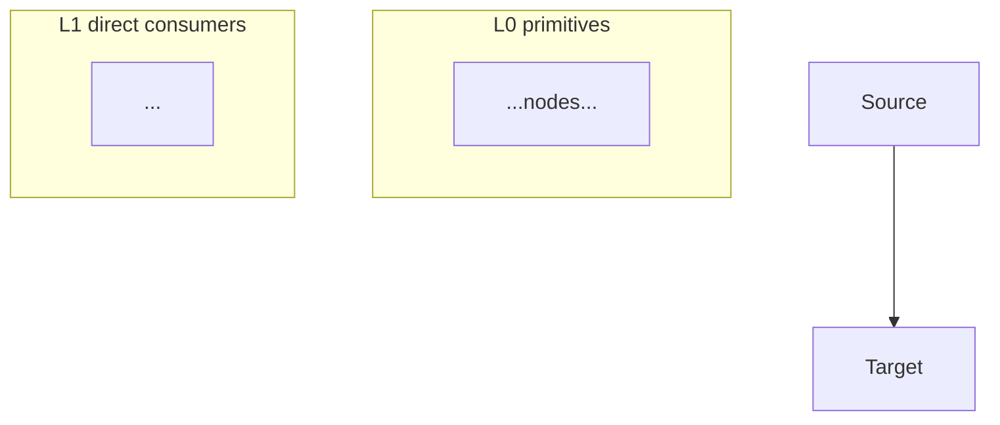

# Phase 5: Injection DAG + App Integration

> **CLI gate commands** (no audit hook on Phase 5):
> - `schematic mermaid` — validate the `.mmd` diagram after writing it.
> - `schematic phase sign-off --schematic <name> 5` — on user `y`.
> - `schematic phase complete --schematic <name> 5` — immediately after sign-off.

Write DAG edge inventory and app integration to `<schematic_dir>/components/_overview.md`. Write the mermaid diagram to `<schematic_dir>/dag.mmd`.

> **Gate enforcement:** `schematic phase complete` will reject if `components/_overview.md` does not contain `## Injection DAG` and `## App Integration`, **or if `dag.mmd` fails mermaid validation** — the diagram must parse before the phase can lock.

> **Surface the visual tools (mandatory, once per phase):** when presenting the DAG gate, tell the user the diagram is viewable and hand-editable right now — `schematic overview` renders it in the dashboard (Diagrams tab), and the bundled live editor opens it directly: `python3 <skill_dir>/reference/mermaid_edit/bridge.py <schematic_dir>/dag.mmd`. Don't leave these discoverable-only.

## Section A: Injection DAG

Shows the constructor injection graph. `A -> B` means `A` is constructor-injected into `B`. The graph must be a complete DAG — no cycles.

**Presentation (BINDING — user rule 2026-07-15):** ALWAYS create the Mermaid diagram (`dag.mmd`, validated) and AUTO-OPEN it in the schematic editor — no asking (`python3 <skill_dir>/reference/mermaid_edit/bridge.py <schematic_dir>/dag.mmd`, backgrounded, + arm the Q&A watcher). The user reviews the diagram in the editor BEFORE the gate's Confirm. Never hand-draw ASCII graph art in chat.

**Mermaid DAG rules (binding for the `dag.mmd` file):**



Required structural rules:
1. Outer flowchart direction = `TB` (top-bottom). Layers stack vertically.
2. Each topological level wrapped in a `subgraph` with `direction LR` inside.
3. Order nodes within each subgraph left-to-right column-aligned to their primary L+1 consumer.
4. Use `curve: 'linear'` — orthogonal edges are easier to follow than splines.
5. No fill colour for styled nodes — border-only (`stroke-width`, `stroke-dasharray`).
6. Edge labels only when they add information.
7. **Driving AC ref per node** — annotate each NEW node with the Feature AC that necessitated it (Mermaid: a `%% <AC>` comment or node-label suffix; ASCII: a trailing `← <AC>`). Keeps the *why* present so the DAG isn't a wiring diagram floating free of intent.
8. **Dashboard theme compatibility** — the schematic dashboard is dark by default; any explicit Mermaid colours must be dark-mode safe. Do not use light `rect rgb(...)`, light node fills, or pale backgrounds that wash out dark-theme text. Prefer no explicit fills unless the user asks for them.

**ASCII DAG rules (when ≤8 nodes):**
- All arrows point DOWN (or down-diagonal). No upward arrows, no horizontal.
- Each node appears exactly once. No node duplication.
- Show EVERY edge. No "(also into X)" annotations.
- Lines and arrowheads must terminate ON their target node.

**Inline ASCII at >8 nodes is permitted ON REQUEST only.** Warn that ASCII has no layout engine and the mermaid file remains authoritative.

## Section B: App Integration

Show exactly where the feature connects into the existing platform architecture:

- **Integration type**: Extending an existing component, or a new entry point?
- **Existing component being modified** (if extending): What class gains a new constructor param?
- **Entry point** (if new): What triggers it and where it's registered?
- **Downstream call chain** (ASCII):
  ```
  Entry
    ├─> step
    └─> step
  ```
- **Bootstrap diff** (+ new constructions, ~ modified, - removed)

Phase 5 has no dedicated audit hook — drift in the DAG is caught by the topology audit's edge-consistency check and the sequence audit's "DAG supports every call direction" check.

**Confirm: y/comment**

---

**Next:** `phase_6_sequence.md`
